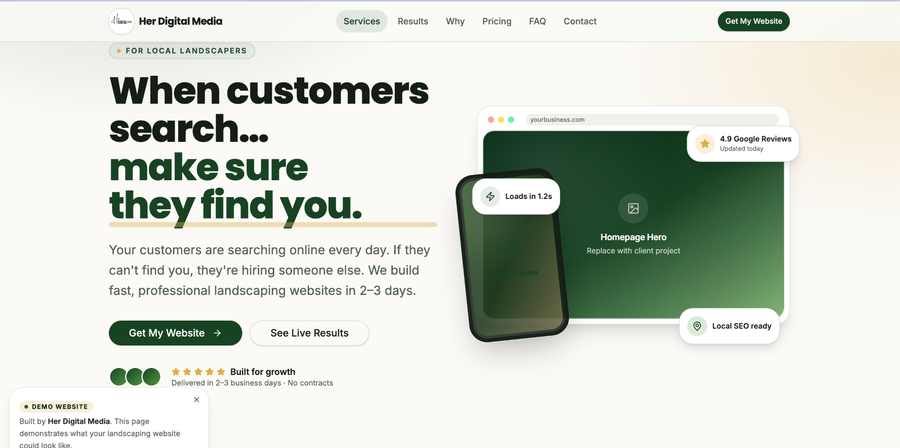
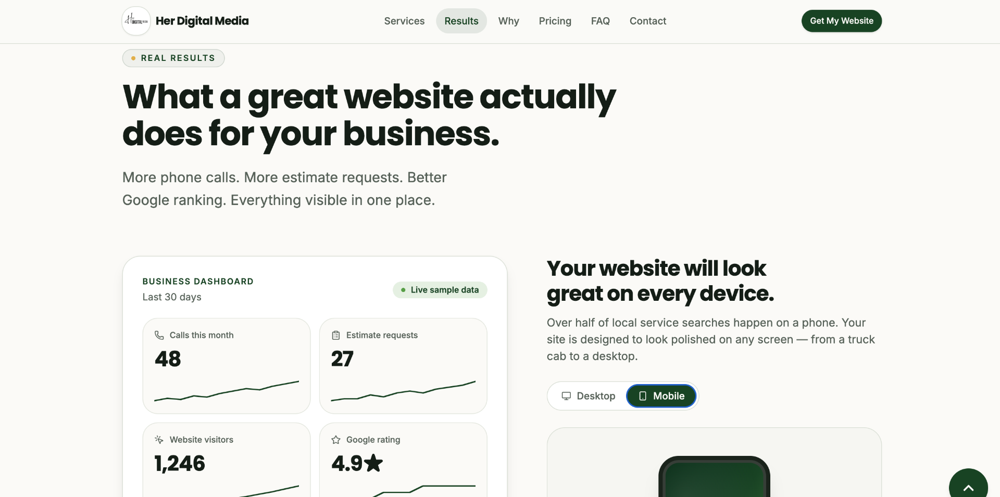
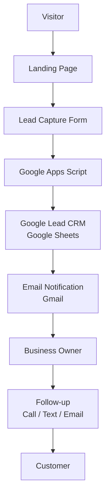

# Local Business Growth Platform

*Case Study: Premium Lead Generation Website & Google Workspace CRM*

A reusable, production-ready website platform that helps local service businesses get found online, capture leads, and manage them — without paying for a database, a CRM, or a marketing SaaS stack.


**[Live Demo](https://herdigitalmedia.com)** · **[Source Code](#)** <!-- TODO: GitHub repo URL --> · **[Portfolio](#)** <!-- TODO: portfolio URL --> · **[Contact](#contact)**

---

## Key Outcomes

| | |
|---|---|
| ✔ **Production-ready architecture** | Type-safe React 19 + TanStack Start with strict TypeScript, semantic HTML, and SSR-ready routing. |
| ✔ **Reusable multi-industry foundation** | One codebase powers landscaping, HVAC, plumbing, roofing, cleaning, dental, med spa, and more. |
| ✔ **Zero monthly software cost backend** | Lead capture runs on Google Sheets + Apps Script + Gmail — no database bills, no SaaS lock-in. |
| ✔ **Google Workspace integration** | Owners keep their leads in a tool they already know and control. |

---

## Table of Contents

- [Project Goals](#project-goals)
- [Project Overview](#project-overview)
- [My Role](#my-role)
- [Screenshots](#screenshots)
- [Feature Highlights](#feature-highlights)
- [Architecture — Business Workflow](#architecture--business-workflow)
- [Business Impact](#business-impact)
- [Reusable Architecture](#reusable-architecture)
- [Why Google Workspace?](#why-google-workspace)
- [Design & Engineering Decisions](#design--engineering-decisions)
- [Developer Highlights](#developer-highlights)
- [Technology Stack](#technology-stack)
- [Folder Structure](#folder-structure)
- [Performance & Quality](#performance--quality)
- [Future Roadmap](#future-roadmap)
- [What I Would Build Next](#what-i-would-build-next)
- [Lessons Learned](#lessons-learned)
- [About the Developer](#about-the-developer)
- [Contact](#contact)
- [Final Thoughts](#final-thoughts)

---

## Project Goals

- Build a reusable platform for local service businesses.
- Demonstrate a scalable frontend architecture with modern React and TypeScript patterns.
- Replace expensive SaaS tools with Google's free ecosystem where it makes sense.
- Prioritize accessibility, SEO, and performance from day one.
- Ship something a real small-business owner could sign up for tomorrow.

---

## Project Overview

Most local service businesses lose customers before the phone even rings. Their site is slow, hard to read on a phone, or missing entirely — so shoppers pick a competitor who shows up on Google.

This project is a premium, conversion-focused website platform built for those businesses. It is designed for landscapers, HVAC techs, plumbers, roofers, cleaners, electricians, dental offices, salons, and med spas — anyone whose customers search "near me."

> **Why it matters:** the platform turns a website from a brochure into a working lead machine that pays for itself with a single new job.

**Business value** — more calls, more estimate requests, better Google visibility, organized lead intake.
**User value** — a fast, mobile-first, trustworthy experience with clear calls to action and a form that just works.

---

## My Role

I owned the project end to end. Responsibilities included:

- Product strategy and positioning
- UX planning and information architecture
- UI design direction (color, typography, motion)
- Frontend engineering in React 19 + TypeScript
- Component architecture and design system
- Backend integration planning
- Google Workspace workflow (Sheets + Apps Script + Gmail)
- SEO strategy (metadata, JSON-LD, semantic HTML)
- Accessibility planning (keyboard, focus, reduced motion, contrast)

---

## Screenshots

### 1. Hero — First Impression That Converts



- **Purpose** — Answer "should I trust you?" and "what do you do?" in under three seconds.
- **Challenge** — Small business owners scroll fast on their phone; a generic hero loses them.
- **Solution** — Two-line editorial headline, live urgency chips ("Loads in 1.2s", "4.9 Google Reviews", "Local SEO ready"), and a stacked device mockup that shows the product in context.
- **Business Value** — Communicates speed, credibility, and local focus at a glance, driving higher CTA click-through.
- **Engineering Highlights** — Framer Motion for reveal animations, semantic `<h1>` + eyebrow tag for SEO, `prefers-reduced-motion` respected, all copy driven from `src/data/site.ts`.

### 2. Results Dashboard — Proof, Not Promises



- **Purpose** — Show, in the owner's language, what a great website actually does: calls, estimates, visitors, and star rating.
- **Challenge** — Abstract terms like "conversion rate" mean nothing to a landscaper. Numbers do.
- **Solution** — A live-feeling business dashboard with sparklines and a mobile-first device preview toggle, using sample data clearly labeled as illustrative.
- **Business Value** — Turns "you need a website" into "here is what a website will do for you this month."
- **Engineering Highlights** — Reusable `Counter` and sparkline components, `IntersectionObserver`-driven reveals, mobile/desktop toggle with a single state hook.

---

## Feature Highlights

| Feature | What it is | Why it exists | User benefit |
|---|---|---|---|
| Responsive Design | Mobile-first layout across every block | Most local searches happen on a phone | Site looks great everywhere |
| Interactive UI | Animated reveals, ROI calculator, device toggle | Turns a static page into a demo | Owners *feel* what they are buying |
| Lead Capture | 8-field intake form with validation | Qualified leads beat raw traffic | Owners get context, not just names |
| Google Sheets Integration | Every submission appends a row | Free, familiar, portable CRM | Owners keep and export their data |
| Apps Script Backend | Handles POST, formatting, and email | Serverless, zero cost, easy to teach | No database to babysit |
| Gmail Notifications | Instant email on every new lead | Speed to lead equals higher close rate | Owner replies while intent is hot |
| SEO Optimization | Metadata, canonical, LocalBusiness + FAQPage JSON-LD | Local search rankings | More qualified organic traffic |
| Local Business Focus | Copy, icons, and CTAs built around service businesses | Generic templates convert poorly | Feels made for the owner's world |
| Reusable Architecture | Content-driven via `src/data/site.ts` | One codebase, many industries | Faster launches, lower cost |
| Accessibility | Semantic HTML, keyboard focus, reduced motion, contrast | Everyone deserves a usable site | Wider reach, fewer legal risks |
| Performance | Vite 7, code-split routes, optimized assets | Slow sites lose customers | Fast loads mean higher conversion |
| Mobile First | Every block designed for small screens first | Truck-cab and job-site users | Nothing feels bolted on |
| Smooth Animations | Framer Motion with `prefers-reduced-motion` | Polish without dizzying users | Premium feel, accessible defaults |

---

## Architecture — Business Workflow

This is the end-to-end path from stranger to paying customer. Every step exists for a reason.



**Why each step exists**

- **Visitor → Landing Page** — SEO, local schema, and social share metadata bring the right shopper in.
- **Landing Page → Lead Capture** — Every section funnels attention toward a single 8-field form.
- **Lead Capture → Apps Script** — A serverless endpoint accepts `POST` with `mode: 'no-cors'`, so there is nothing for the owner to host.
- **Apps Script → Sheets CRM** — Every lead is appended as a row with timestamp, business type, and timeline. The owner sees their pipeline in a tool they already open every day.
- **Sheets → Gmail** — An automatic email fires so the owner can respond in minutes, not hours.
- **Owner → Follow-up → Customer** — Fast, human follow-up closes the loop.

---

## Business Impact

| Without this system | With this system |
|---|---|
| Lost inquiries between Facebook DMs and voicemail | Every lead captured in one organized place |
| Manual lead tracking on paper or in a notes app | Structured rows in Google Sheets with timestamps |
| No online presence beyond a personal profile | A ranked, mobile-first site optimized for local search |
| Slow response time; leads go cold | Instant Gmail notification the moment a lead submits |
| No way to measure what is working | Timeline and service fields reveal customer intent |
| Recurring SaaS bills eat margin | Zero monthly software cost |

---

## Reusable Architecture

All copy, services, pricing, FAQs, metrics, reviews, and roadmap items live in a single typed data module (`src/data/site.ts`). Retargeting the platform for a new industry is a data swap, not a rewrite.

| Industry | Ready |
|---|---|
| Landscaping | ✓ |
| HVAC | ✓ |
| Plumbing | ✓ |
| Roofing | ✓ |
| Cleaning | ✓ |
| Electricians | ✓ |
| Construction | ✓ |
| Med Spa | ✓ |
| Salon | ✓ |
| Dental | ✓ |

> **Note:** Components are structural. They read from typed content objects and do not hardcode industry-specific copy, icons, or metadata.

---

## Why Google Workspace?

I chose Google Sheets + Apps Script + Gmail over Supabase, Firebase, or a paid CRM on purpose.

- **Zero monthly software costs** — Owners already have a Google account. No new bill, ever.
- **Client ownership** — The Sheet lives in *their* Drive. If they fire me tomorrow, they still have every lead.
- **Easy onboarding** — Owners already know how to filter, sort, and share a spreadsheet.
- **Easy maintenance** — Apps Script is a single file. No servers, no migrations, no cold starts.
- **Scales for small business** — Sheets handles thousands of rows; when a client outgrows it, we lift-and-shift to a real database with the schema already defined.

> **Why it matters:** the right backend is the one the owner can actually use.

---

## Design & Engineering Decisions

<details>
<summary><strong>Why Google Sheets instead of a database</strong></summary>

A database is powerful but overkill for a solo owner receiving five leads a week. Sheets gives them ownership, portability, and zero DevOps. When they scale, the schema ports cleanly to Postgres.
</details>

<details>
<summary><strong>Why reusable, content-driven components</strong></summary>

Every block reads from `src/data/site.ts`. Copy lives with data, not JSX. Retargeting the site for a new industry is a data swap. This keeps the surface area small and easy to test.
</details>

<details>
<summary><strong>Why industry-agnostic under the hood</strong></summary>

Local service businesses share the same buyer journey: search, trust, contact. Building for the pattern instead of a single vertical lets one codebase serve many clients.
</details>

<details>
<summary><strong>Why ownership over subscriptions</strong></summary>

Small businesses have been burned by rented websites they cannot export. The platform ships as code the owner keeps. Domain and hosting are their own accounts.
</details>

<details>
<summary><strong>Why performance and accessibility are non-negotiable</strong></summary>

Slow, inaccessible sites cost real money in lost conversions and legal risk. Semantic HTML, keyboard focus, `prefers-reduced-motion`, and contrast tuning are shipped by default, not added later.
</details>

<details>
<summary><strong>How I approached scalability</strong></summary>

Content is typed, components are modular, routes are file-based, and the backend is a single Apps Script endpoint. Every layer can be swapped independently — Sheets to Postgres, Apps Script to a real API, Gmail to Twilio — without rewriting the front end.
</details>

---

## Developer Highlights

- **Component-driven architecture** — Small, focused blocks composed into one page.
- **Separation of content and presentation** — Data in `src/data/site.ts`, structure in components.
- **Configuration-driven setup** — Endpoints and site config isolated in `src/config/site.ts`.
- **Modular sections** — Eight self-contained blocks, each independently editable.
- **Mobile-first approach** — Layouts scale up, not down.
- **Accessible UI** — Semantic HTML, ARIA where needed, focus rings preserved, motion-safe animations.
- **SEO-first development** — Route-level metadata, canonical URLs, LocalBusiness and FAQPage JSON-LD.
- **Performance optimization** — Vite 7, code splitting, optimized assets, minimal client JS.
- **Production-ready organization** — Strict TypeScript, prettier, eslint, typed data contracts.

---

## Technology Stack

| Category | Tools |
|---|---|
| Frontend | React 19, TanStack Start v1, TanStack Router, TypeScript (strict) |
| Styling | Tailwind CSS v4, CSS design tokens, shadcn/ui primitives |
| Motion | Framer Motion |
| Backend | Google Apps Script (serverless endpoint) |
| Data | Google Sheets (lead CRM) |
| Notifications | Gmail (automatic email on submit) |
| Hosting | Lovable / Cloudflare Workers-compatible edge runtime |
| Build | Vite 7 |
| Design | Custom color system (forest green + warm gold), semantic tokens |
| Dev Tools | Bun, ESLint, Prettier, TypeScript |
| Testing | Vitest-ready, Playwright-ready |
| Icons | Lucide |
| Fonts | Poppins (display), Inter (body) |
| Analytics | Ready for GA4 or Plausible |

---

## Folder Structure

```text
src/
├── routes/              # File-based routing (TanStack Start)
│   ├── __root.tsx       # HTML shell, global metadata, favicon
│   └── index.tsx        # Home page — composes the 8 blocks + JSON-LD
├── components/
│   ├── site/            # Case-study blocks: hero, services, results, proof, online, offer, growth, close
│   └── ui/              # shadcn primitives (button, form, accordion, etc.)
├── data/
│   └── site.ts          # Industry-agnostic content: copy, services, pricing, FAQs, reviews
├── config/
│   └── site.ts          # Runtime config: contact endpoint, email
├── lib/
│   ├── contact.ts       # POST helper for the Apps Script endpoint
│   └── utils.ts         # Small helpers
├── hooks/               # Custom React hooks (e.g. useIsMobile)
├── types/
│   └── contact.ts       # ContactSubmission contract shared by form + backend
├── assets/              # Logo asset pointer(s)
└── styles.css           # Tailwind v4 entry + design tokens
docs/
└── screenshots/         # Case-study images referenced by this README
```

---

## Performance & Quality

- Fast loading — Vite 7 build, code-split routes, minimal client JS
- Fully responsive — mobile-first across every block
- Semantic HTML — proper heading order, landmarks, and labels
- SEO-ready — metadata, canonical, LocalBusiness + FAQPage JSON-LD
- Accessible — keyboard focus, reduced motion, color contrast
- Production-ready — strict TypeScript, linting, formatted code
- Reusable components — data-driven, easy to retarget
- Maintainable architecture — clear separation of concerns

---

## Future Roadmap

| Planned | Description |
|---|---|
| Client Dashboard | A private view of leads, calls, and conversion trends |
| Google Calendar Integration | Book estimates directly from the site |
| CRM Enhancements | Tags, statuses, and follow-up reminders in Sheets |
| Appointment Scheduling | Self-serve booking flow with confirmations |
| Analytics Dashboard | Traffic, source, and conversion insight in one view |
| AI Assistant | Answers FAQs and pre-qualifies leads 24/7 |
| Business Automation | Text and email drip after form submission |

---

## What I Would Build Next

- **Authentication** — Owner login for the client dashboard
- **Customer portal** — Customers can see estimates, invoices, and appointments
- **Dashboard** — Real-time lead and revenue view
- **Appointment scheduling** — Calendar-backed booking with confirmations
- **Analytics** — Traffic and conversion metrics in plain English
- **Payment integration** — Stripe deposits and invoicing
- **AI assistant** — Instant answers and lead pre-qualification
- **CRM enhancements** — Pipelines, tags, and automated follow-ups

---

## Lessons Learned

The hardest part of small-business software is not the code — it is respecting how the owner actually works. Choosing Google Sheets over a database felt "less impressive" on paper, but it removed the single biggest blocker to adoption: a new tool to learn.

I also learned to design content and components as two separate concerns. Once copy moved into a typed data module, retargeting the site for a new industry became a 30-minute job instead of a week.

Finally, this project reinforced how much performance and accessibility affect *revenue*, not just Lighthouse scores. A one-second delay is a lost customer.

---

## About the Developer

I build production-ready web platforms for real businesses. My strengths span:

- Frontend engineering (React, TypeScript, TanStack, Tailwind)
- UI/UX and design systems
- Accessibility and inclusive design
- Business automation and workflow design
- Cloud integrations (Google Workspace, edge runtimes)
- Scalable, maintainable systems
- Problem solving with a strong product sense

I care as much about the user's outcome as the code that gets them there.

---

## Contact

- **Portfolio** — <!-- TODO: portfolio URL -->
- **GitHub** — <!-- TODO: GitHub profile URL -->
- **LinkedIn** — <!-- TODO: LinkedIn URL -->
- **Email** — [tb23la@gmail.com](mailto:tb23la@gmail.com)

---

## Final Thoughts

This project demonstrates how modern frontend engineering, thoughtful UX, and simple backend automation can deliver enterprise-quality experiences for small businesses without introducing unnecessary complexity or recurring software costs.

It reflects my approach to building software that is scalable, maintainable, accessible, and focused on solving real business problems.
